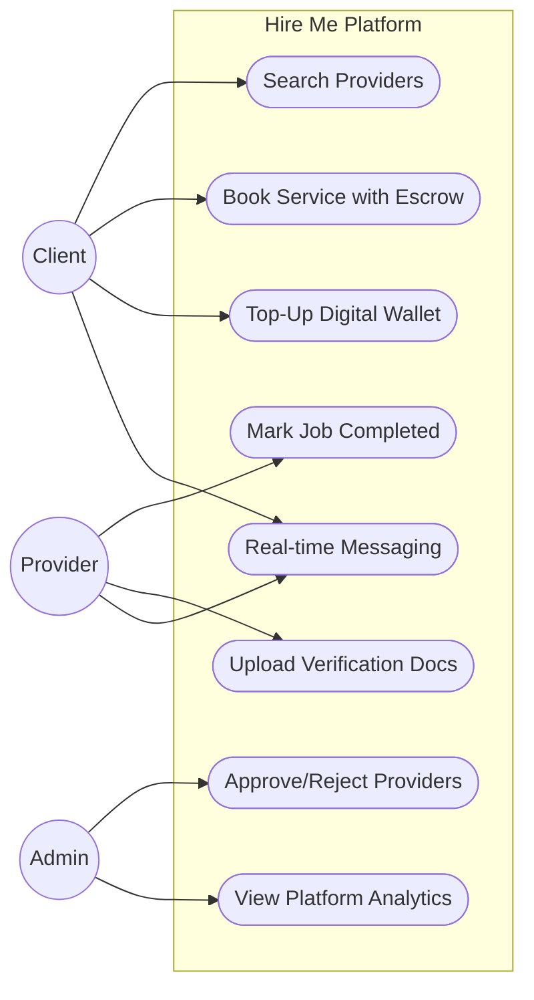
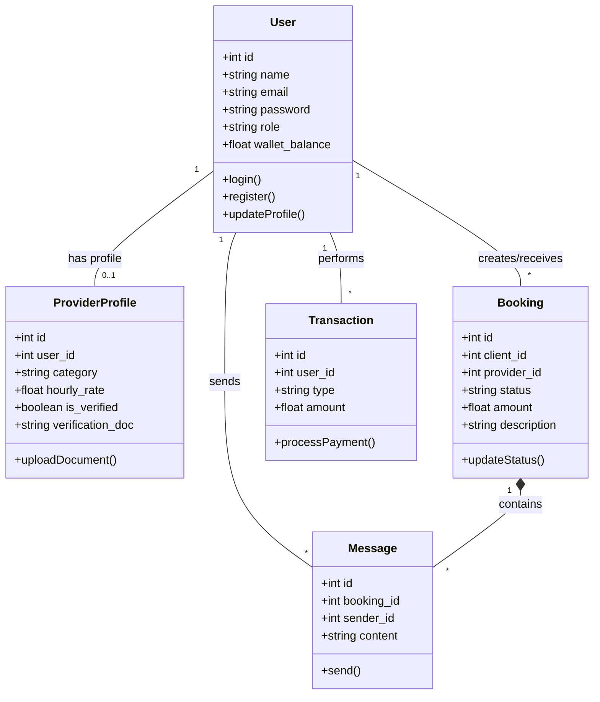
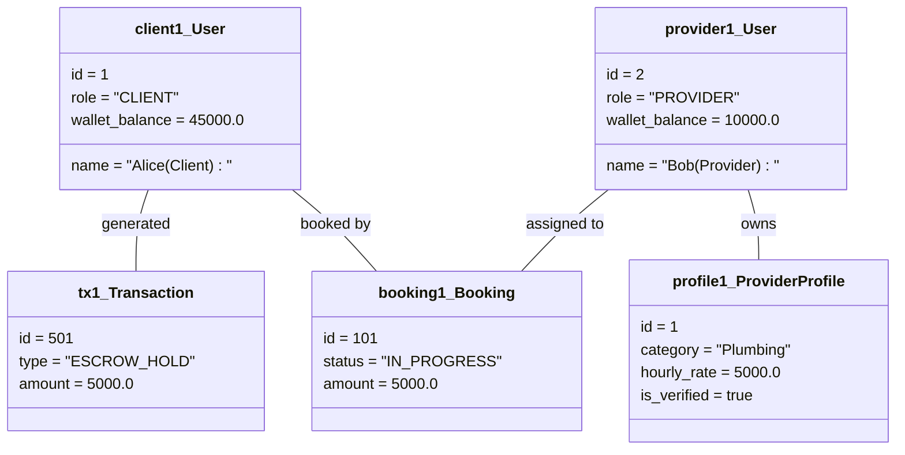
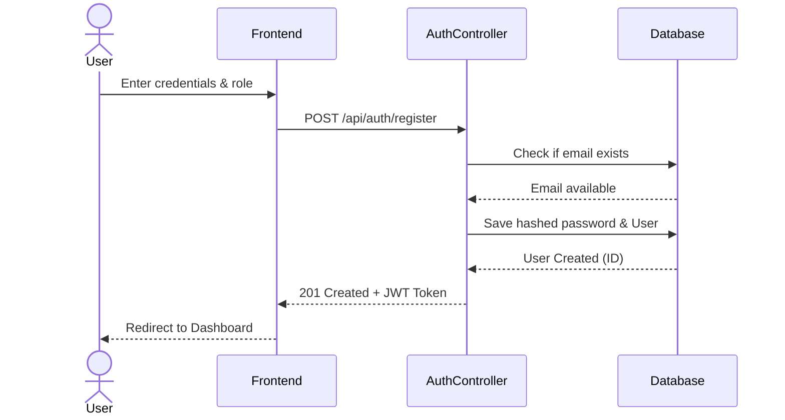
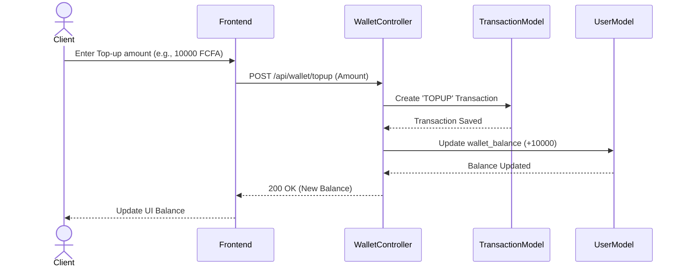
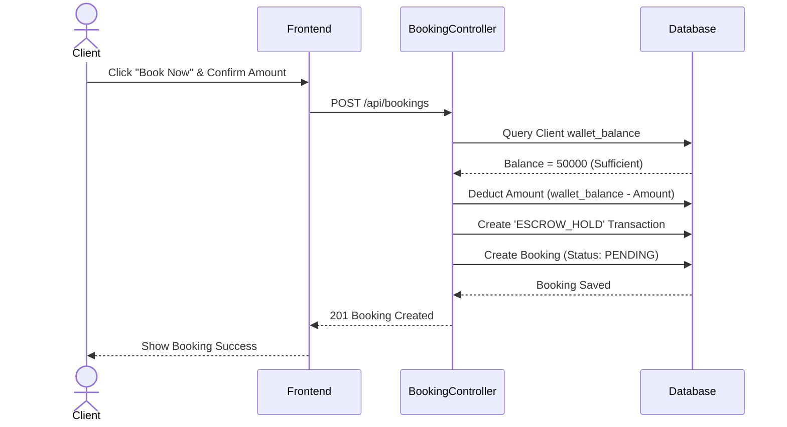
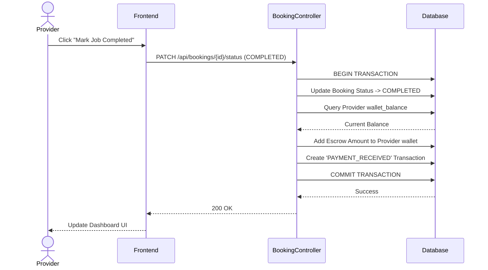
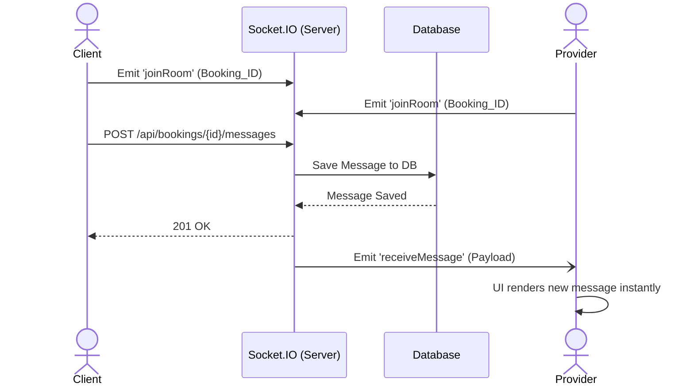

# Phase 3: UML Design Documentation - "Hire Me"

This document contains the complete structural and behavioral UML models for the "Hire Me" platform, required for Phase 3 of your timeline.

---

## 1. Comprehensive Use Case Diagram
This diagram illustrates the primary actors (Client, Provider, Admin) and their interactions with the system's core functionalities.

---

## 2. Class Diagram
The Class Diagram displays the database-backed models (User, ProviderProfile, Booking, Transaction, Message), their attributes, methods, and multiplicities.

---

## 3. Sample Object Diagram
This Object Diagram shows a snapshot of the system in memory when a Client (Alice) has an active booking with a Provider (Bob), and the funds are held in escrow.

---

## 4. Sequence Diagrams (Flow of Messages)

### Sequence Diagram 1: User Registration & Authentication
Demonstrates how a new user registers and retrieves a JWT for subsequent API requests.

### Sequence Diagram 2: Wallet Top-Up Simulation
Demonstrates the local Mobile Money simulation updating a user's wallet.

### Sequence Diagram 3: Booking Creation & Escrow Hold
Shows the critical path where a client books a provider and funds are locked into Escrow.

### Sequence Diagram 4: Job Completion & Escrow Release
Shows the atomic transaction flow when a provider completes the job and receives the escrowed funds.

### Sequence Diagram 5: Real-Time Chat (WebSockets)
Shows how messages are exchanged instantly between Client and Provider.

