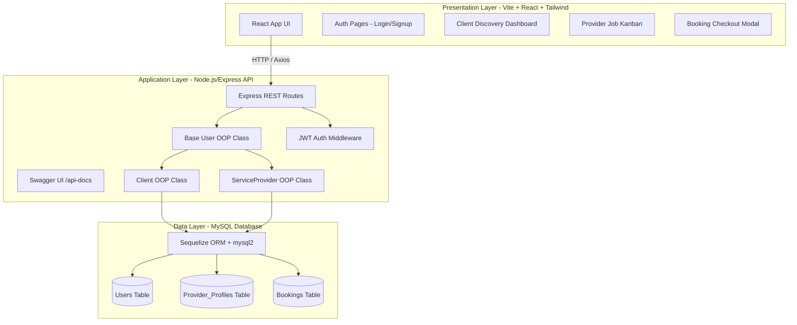

# Implementation Plan: "Hire Me" On-Demand Local Services Marketplace

Comprehensive technical execution plan for the **Hire Me** system based on the specification in [overview.md](file:///c:/Users/NTS/Documents/hire-me/overview.md).

## Goal Description
Build a full-stack 3-tier decoupled application connecting local clients with skilled day-to-day professionals (tutors, electricians, plumbers, etc.). The solution enforces strict Object-Oriented Programming principles (Inheritance & Encapsulation) on the backend using Node.js/Express, MySQL (`mysql2`), and Sequelize ORM, paired with a Vite + React.js + Tailwind CSS frontend interface and automated Swagger API documentation.

---

## Technical Choices & User Decisions

* **Database**: Local MySQL server for development. Free-tier cloud MySQL (e.g. Aiven / Railway / Render DB) for live deployment.
* **Frontend Tooling**: **Vite + React** for rapid development and optimized builds.
* **Hosting Targets**:
  * **Frontend**: Vercel
  * **Backend & Database**: Render + Cloud MySQL

---

## Proposed Architecture & Component Design



---

## Proposed Changes

### Root Workspace Setup
- Initialize Git repository structure with `backend/` and `frontend/` folders.

---

### Backend Layer (`backend/`)

#### [NEW] [package.json](file:///c:/Users/NTS/Documents/hire-me/backend/package.json)
Node.js dependencies: `express`, `sequelize`, `mysql2`, `dotenv`, `bcryptjs`, `jsonwebtoken`, `cors`, `swagger-ui-express`, `swagger-jsdoc`. Dev dependencies: `jest`, `supertest`, `nodemon`.

#### [NEW] [.env.example](file:///c:/Users/NTS/Documents/hire-me/backend/.env.example)
Database environment variables (`DB_HOST`, `DB_USER`, `DB_PASS`, `DB_NAME`, `DB_PORT`, `JWT_SECRET`, `PORT`).

#### [NEW] [database.js](file:///c:/Users/NTS/Documents/hire-me/backend/src/config/database.js)
Sequelize configuration connecting to local MySQL instance.

#### [NEW] [User.js](file:///c:/Users/NTS/Documents/hire-me/backend/src/models/User.js)
Sequelize model mapping `Users` table (`id`, `name`, `email`, `password_hash`, `role`).

#### [NEW] [ProviderProfile.js](file:///c:/Users/NTS/Documents/hire-me/backend/src/models/ProviderProfile.js)
Sequelize model mapping `Provider_Profiles` (`id`, `user_id`, `trade`, `hourly_rate`, `bio`).

#### [NEW] [Booking.js](file:///c:/Users/NTS/Documents/hire-me/backend/src/models/Booking.js)
Sequelize model mapping `Bookings` (`id`, `client_id`, `provider_id`, `status`, `job_date`, `description`).

#### [NEW] [UserClass.js](file:///c:/Users/NTS/Documents/hire-me/backend/src/classes/UserClass.js)
Base OOP class implementing `id`, `name`, `email`, `role`, and core auth methods.

#### [NEW] [ClientClass.js](file:///c:/Users/NTS/Documents/hire-me/backend/src/classes/ClientClass.js)
Derived OOP class inheriting from `UserClass` for client actions (`requestBooking`, `cancelBooking`, `leaveReview`).

#### [NEW] [ServiceProviderClass.js](file:///c:/Users/NTS/Documents/hire-me/backend/src/classes/ServiceProviderClass.js)
Derived OOP class inheriting from `UserClass` for provider actions (`acceptJob`, `rejectJob`, `completeJob`).

#### [NEW] [authController.js](file:///c:/Users/NTS/Documents/hire-me/backend/src/controllers/authController.js)
REST controllers for `/api/auth/register` and `/api/auth/login`.

#### [NEW] [providerController.js](file:///c:/Users/NTS/Documents/hire-me/backend/src/controllers/providerController.js)
REST controller for `/api/providers` (filtering by trade category & max rate).

#### [NEW] [bookingController.js](file:///c:/Users/NTS/Documents/hire-me/backend/src/controllers/bookingController.js)
REST controllers for `/api/bookings` creation and `PATCH /api/bookings/:id` status updates.

#### [NEW] [swagger.js](file:///c:/Users/NTS/Documents/hire-me/backend/src/config/swagger.js)
Swagger UI configuration exposing `/api-docs`.

#### [NEW] [server.js](file:///c:/Users/NTS/Documents/hire-me/backend/src/server.js)
Express entry point syncing Sequelize models and starting server.

---

### Frontend Layer (`frontend/`)

#### [NEW] [Vite App Scaffold](file:///c:/Users/NTS/Documents/hire-me/frontend)
Vite + React application initialized with Axios and Tailwind CSS.

#### [NEW] [App.jsx](file:///c:/Users/NTS/Documents/hire-me/frontend/src/App.jsx)
Router setup handling Auth, Client Dashboard, Provider Dashboard, and Protected Routes.

#### [NEW] [LandingAuth.jsx](file:///c:/Users/NTS/Documents/hire-me/frontend/src/pages/LandingAuth.jsx)
Auth landing page with role selector (Client vs Provider signup).

#### [NEW] [ClientDashboard.jsx](file:///c:/Users/NTS/Documents/hire-me/frontend/src/pages/ClientDashboard.jsx)
Provider discovery view with real-time search filtering.

#### [NEW] [ProviderDashboard.jsx](file:///c:/Users/NTS/Documents/hire-me/frontend/src/pages/ProviderDashboard.jsx)
Kanban-style job management interface (Pending, Active, Completed).

#### [NEW] [BookingModal.jsx](file:///c:/Users/NTS/Documents/hire-me/frontend/src/components/BookingModal.jsx)
Job request checkout modal.

---

### Testing Suite (`backend/tests/`)

#### [NEW] [auth.test.js](file:///c:/Users/NTS/Documents/hire-me/backend/tests/auth.test.js)
Jest tests validating OOP model behavior and HTTP status responses.

---

## Verification Plan

### Automated Tests
- Backend Jest tests:
  ```bash
  cd backend && npm test
  ```

### Manual Verification
- Launch backend on `http://localhost:5000` and frontend on `http://localhost:5173`.
- Verify Swagger documentation at `http://localhost:5000/api-docs`.
- Test full end-to-end client booking and provider acceptance flow.
